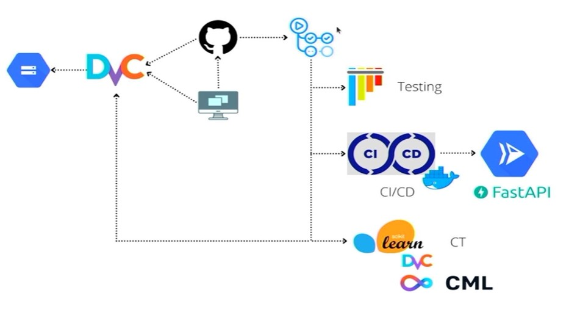

# MLops Project
This project uses a combination of tools to create a complete MLops cycle.

## Diagrama

## Tools used
- Notebooks
- .py files creating modules
- DVC
- FastAPI
- CI/CD
- CML
- Git
- Github Actions
- Google Storage
### Notebooks
Notebooks are a tool for creating and running code interactively. In this project, they are used to experiment with machine learning models.

### .py files creating modules
.py files are used to create reusable modules that can be imported and used in other scripts.

### DVC
DVC is a tool for managing and controlling data and models in machine learning projects.

### FastAPI
FastAPI is a framework for creating APIs with Python. In this project, it is used to create an API that can be used for making predictions with the machine learning models.

### CI/CD
CI/CD (Continuous Integration / Continuous Deployment) is a practice that allows for automating the building, testing, and deployment of software. In this project, it is used to ensure that code and model changes are constantly and automatically implemented.

### CML
CML (Continuous Machine Learning) is a practice that allows for automating and improving machine learning model experimentation and training.

### Git
Git is a version control system that allows for maintaining a record of code and model changes.

### Github Actions
Github Actions is a CI/CD service offered by Github. In this project, it is used to run automated CI/CD actions.

### Google Storage (you can use whichever as S3, firestore, g-drive, azure store)
Google Storage is a cloud storage service that allows for storing and retrieving data and models. In this project, it is used to store the data and models used in the machine learning models.

## How to run the project
Please follow the instructions in the README.md file to run the project in your local environment.

## Installation guide

Please read [install.md](install.md) for details on how to set up this project.

## Project Organization

    ├── LICENSE
    ├── tasks.py           <- Invoke with commands like `notebook`.
    ├── README.md          <- The top-level README for Data Scientist using this project.
    ├── install.md         <- Detailed instructions to set up this project.
    ├── data
    │   ├── external       <- Data from third party sources.
    │   ├── interim        <- Intermediate data that has been transformed.
    │   ├── processed      <- The final, canonical data sets for modeling.
    │   └── raw            <- The original, immutable data dump.
    │
    ├── models             <- Trained and serialized models, model predictions, or model summaries.
    │
    ├── notebooks          <- Jupyter notebooks. Naming convention is a number (for ordering),
    │                         the creator's initials, and a short `-` delimited description, e.g.
    │                         `1.0-fmh-initial-data-exploration`.
    │
    ├── references         <- Data dictionaries, manuals, and all other explanatory materials.
    │
    ├── reports            <- Generated analysis as HTML, PDF, LaTeX, etc.
    │   └── figures         <- Generated graphics and figures to be used in reporting.
    │
    ├── environment.yml    <- The requirements file for reproducing the analysis environment.
    │
    ├── .here              <- File that will stop the search if none of the other criteria
    │                         apply when searching head of project.
    │
    ├── setup.py           <- Makes project pip installable (pip install -e .)
    │                         so mlops_project can be imported.
    │
    └── mlops_project               <- Source code for use in this project.
        ├── __init__.py    <- Makes mlops_project a Python module.
        │
        ├── data           <- Scripts to download or generate data.
        │   └── make_dataset.py
        │
        ├── features       <- Scripts to turn raw data into features for modeling.
        │   └── build_features.py
        │
        ├── models         <- Scripts to train models and then use trained models to make
        │   │                 predictions.
        │   ├── predict_model.py
        │   └── train_model.py
        │
        ├── utils          <- Scripts to help with common tasks.
            └── paths.py   <- Helper functions to relative file referencing across project.
        │
        └── visualization  <- Scripts to create exploratory and results oriented visualizations.
            └── visualize.py

---
Project based on the [cookiecutter conda data science project template](https://github.com/frandak2/cookiecutter-personal).